# AI TARA 智能威胁分析与风险评估平台设计文档

**版本**: 1.0.0
**日期**: 2026-01-29
**状态**: 设计阶段

---

## 目录

1. [概述](#1-概述)
2. [系统架构设计](#2-系统架构设计)
3. [技术栈规范](#3-技术栈规范)
4. [核心模块设计](#4-核心模块设计)
5. [数据模型设计](#5-数据模型设计)
6. [API接口设计](#6-api接口设计)
7. [AI推理引擎设计](#7-ai推理引擎设计)
8. [知识图谱设计](#8-知识图谱设计)
9. [工作流程设计](#9-工作流程设计)
10. [安全设计](#10-安全设计)
11. [部署架构](#11-部署架构)
12. [附录](#附录)

---

## 1. 概述

### 1.1 项目背景

随着汽车产业向"软件定义汽车"(Software Defined Vehicle, SDV)快速转型，车辆已从传统的机械设备演变为集成海量代码、复杂电子电气架构(E/E架构)及持续云端连接的智能移动终端。这种数字化转型虽带来了自动驾驶、智能座舱等革命性体验，但也使汽车网络安全面临前所未有的挑战。

传统的基于人工文档的威胁分析与风险评估(TARA)方法已无法满足快速迭代的开发需求及日益严苛的监管要求。本项目旨在构建一个面向汽车行业的智能TARA平台，实现对汽车网络安全风险的自动化、动态化与智能化分析。

### 1.2 设计目标

| 目标维度 | 具体目标 | 成功指标 |
|---------|---------|---------|
| **合规性** | 严格遵循ISO/SAE 21434标准及UN R155法规 | 100%覆盖标准条款 |
| **智能化** | 利用多模态AI自动识别架构图与生成威胁 | 识别准确率 > 90% |
| **高效性** | 将TARA分析周期从数周缩短至数小时 | 效率提升 > 10倍 |
| **可追溯** | 全流程记录，支持审计追溯 | 100%操作可追溯 |
| **可扩展** | 支持新车型、新威胁库的快速接入 | 扩展无需代码修改 |

### 1.3 核心场景

本平台重点针对以下两个高风险域进行深度分析：

- **车载信息娱乐系统 (IVI)**: 代码量最大、对外接口最多，是最高危的攻击面
- **远程信息处理器 (T-BOX)**: 车辆的"调制解调器"，负责所有与云端的通信，是远程控制功能的物理入口

### 1.4 术语定义

| 术语 | 全称 | 说明 |
|-----|------|-----|
| TARA | Threat Analysis and Risk Assessment | 威胁分析与风险评估 |
| IVI | In-Vehicle Infotainment | 车载信息娱乐系统 |
| T-BOX | Telematics Box | 远程信息处理器 |
| STRIDE | Spoofing, Tampering, Repudiation, Information Disclosure, DoS, Elevation of Privilege | 威胁分类模型 |
| SFOP | Safety, Financial, Operational, Privacy | 影响评估维度 |
| BOM | Bill of Materials | 物料清单 |
| DFD | Data Flow Diagram | 数据流图 |

---

## 2. 系统架构设计

### 2.1 整体架构图

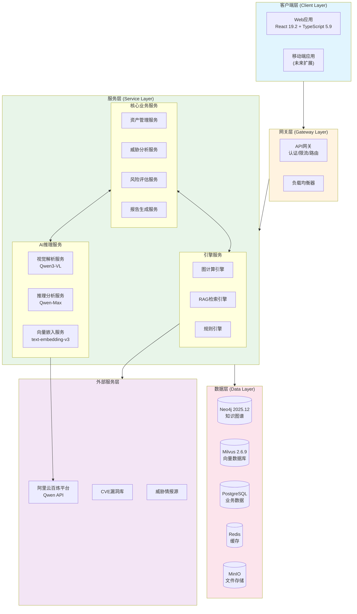

### 2.2 分层架构详解

#### 2.2.1 数据接入层 (Data Ingestion Layer)

负责处理多源异构的工程数据，包括PDF格式的需求规范、Visio/PNG格式的架构图、Excel格式的信号矩阵、XML格式的ARXML文件。

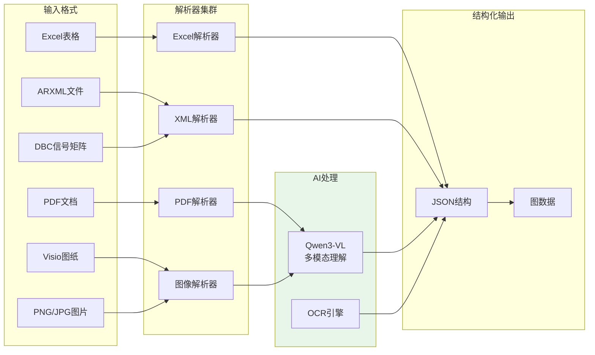

#### 2.2.2 知识图谱层 (Knowledge Graph Layer)

平台的"大脑"，用于存储车辆的数字孪生模型。基于Neo4j图数据库，存储资产、组件、接口、漏洞、威胁及其之间的复杂关系。

#### 2.2.3 AI推理层 (AI Reasoning Layer)

基于阿里云百炼平台的Qwen系列模型构建，包括多模态视觉理解、逻辑推理、语义检索三大能力。

#### 2.2.4 业务应用层 (Application Layer)

提供可视化交互界面，展示攻击路径图、风险热力图，并生成符合ISO 21434标准的报告。

### 2.3 组件交互图

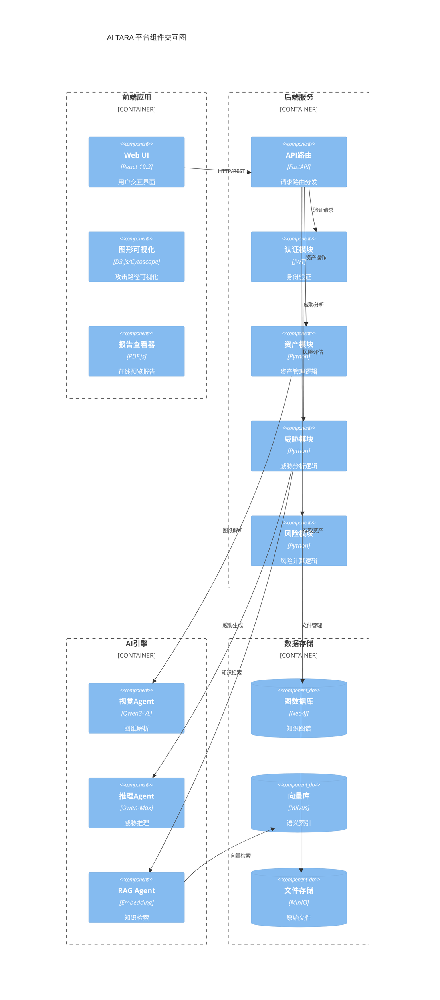

---

## 3. 技术栈规范

### 3.1 后端技术栈

| 技术组件 | 版本 | 用途 | 选型理由 |
|---------|------|-----|---------|
| **Python** | 3.12+ | 后端开发语言 | 丰富的AI生态、类型提示支持 |
| **uv** | 0.9.27 | 包管理器 | Rust实现，速度极快(10-100x pip) |
| **FastAPI** | 0.128.0 | Web框架 | 高性能异步、自动OpenAPI文档 |
| **Pydantic** | 2.12.5 | 数据验证 | 类型安全、性能优异 |
| **structlog** | 25.5.0 | 结构化日志 | JSON输出、上下文绑定 |
| **Neo4j Driver** | 6.1.0 | 图数据库驱动 | 官方异步驱动 |
| **Milvus SDK** | 2.6.x | 向量数据库SDK | 高性能向量检索 |
| **DashScope SDK** | latest | 阿里云AI SDK | 调用Qwen系列模型 |

### 3.2 前端技术栈

| 技术组件 | 版本 | 用途 | 选型理由 |
|---------|------|-----|---------|
| **React** | 19.2.4 | UI框架 | Effect Events、Server Components |
| **TypeScript** | 5.9 | 开发语言 | 类型安全、IDE支持 |
| **Vite** | 7.3.1 | 构建工具 | 极速HMR、优化构建 |
| **Tailwind CSS** | 4.1.18 | CSS框架 | 原子化CSS、5x构建加速 |
| **TanStack Query** | 5.x | 数据获取 | 缓存、乐观更新 |
| **D3.js** | 7.x | 数据可视化 | 自定义图表 |
| **Cytoscape.js** | 3.x | 图可视化 | 网络图、攻击路径 |
| **Zustand** | 5.x | 状态管理 | 轻量、简洁 |

### 3.3 数据存储

| 技术组件 | 版本 | 用途 | 选型理由 |
|---------|------|-----|---------|
| **Neo4j** | 2025.12.1 | 图数据库 | 攻击路径分析、关系查询 |
| **Milvus** | 2.6.9 | 向量数据库 | RAG检索、语义搜索 |
| **PostgreSQL** | 16.x | 关系数据库 | 业务数据、用户管理 |
| **Redis** | 7.x | 缓存 | 会话管理、热点数据 |
| **MinIO** | latest | 对象存储 | 文件存储、兼容S3 |

### 3.4 AI模型

| 模型 | 用途 | 特点 |
|-----|------|-----|
| **Qwen3-VL-Max** | 架构图解析、文档OCR | 高精度视觉理解、3D定位 |
| **Qwen-Max** | 威胁推理、风险评估 | 最强逻辑推理能力 |
| **Qwen-Plus** | 文本处理、格式化 | 性价比平衡 |
| **text-embedding-v3** | 向量嵌入 | RAG检索基础 |

### 3.5 依赖版本锁定策略

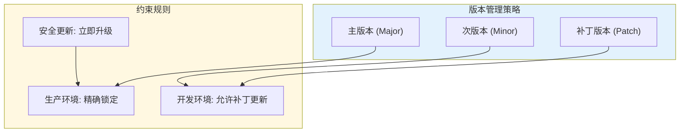

---

## 4. 核心模块设计

### 4.1 模块划分

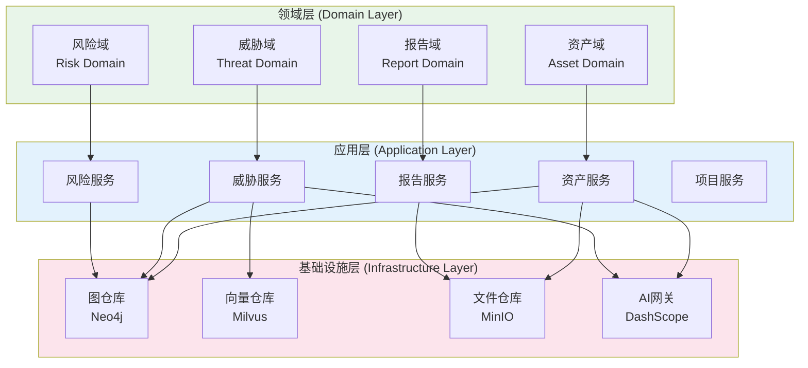

### 4.2 资产管理模块

#### 4.2.1 功能描述

资产管理模块负责从多种格式的工程文档中提取、识别和管理网络安全资产。

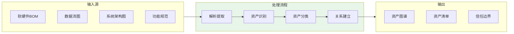

#### 4.2.2 资产分类体系

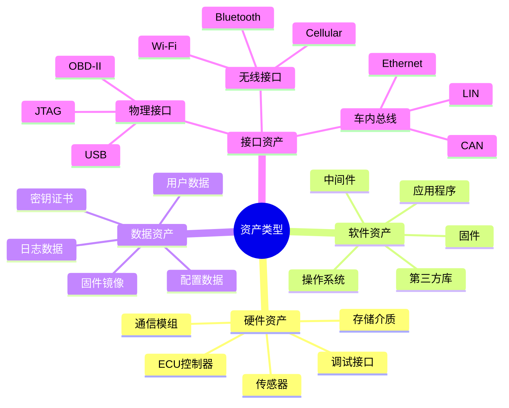

### 4.3 威胁分析模块

#### 4.3.1 STRIDE威胁模型

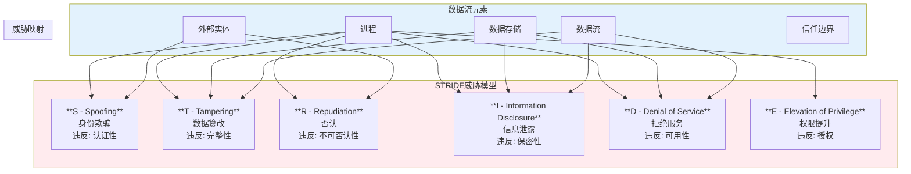

#### 4.3.2 威胁生成流程

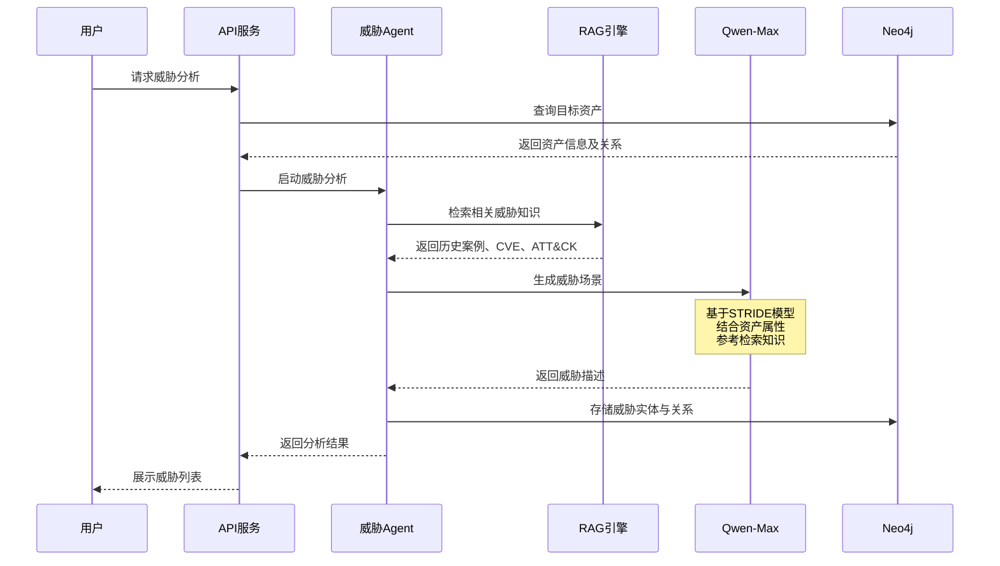

### 4.4 风险评估模块

#### 4.4.1 风险计算公式

$$
\text{Risk Level} = f(\text{Impact Rating}, \text{Attack Feasibility})
$$

#### 4.4.2 影响评级维度 (SFOP)

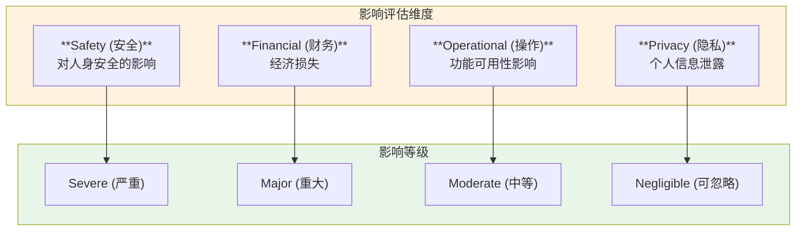

#### 4.4.3 攻击可行性评估

| 评估维度 | 说明 | 评分范围 |
|---------|------|---------|
| **Elapsed Time** | 攻击所需时间 | ≤1天/≤1周/≤1月/>1月 |
| **Specialist Expertise** | 所需专业知识 | 外行/熟练/专家/多专家 |
| **Knowledge of Item** | 对目标了解程度 | 公开/受限/敏感/关键 |
| **Window of Opportunity** | 攻击窗口 | 无限/容易/中等/困难 |
| **Equipment** | 所需设备 | 标准/专业/定制/多定制 |

#### 4.4.4 风险矩阵

```mermaid
quadrantChart
    title 风险矩阵 (Impact vs Feasibility)
    x-axis Low Feasibility --> High Feasibility
    y-axis Negligible Impact --> Severe Impact
    quadrant-1 Critical Risk (5)
    quadrant-2 High Risk (4)
    quadrant-3 Medium Risk (2-3)
    quadrant-4 Low Risk (1)
```

| 攻击可行性 \ 影响等级 | **Severe** | **Major** | **Moderate** | **Negligible** |
|---------------------|-----------|----------|-------------|---------------|
| **High** | 5 (Critical) | 4 (High) | 3 (Medium) | 1 (Low) |
| **Medium** | 4 (High) | 3 (Medium) | 2 (Low) | 1 (Low) |
| **Low** | 3 (Medium) | 2 (Low) | 1 (Low) | 1 (Low) |
| **Very Low** | 2 (Low) | 1 (Low) | 1 (Low) | 1 (Low) |

### 4.5 报告生成模块

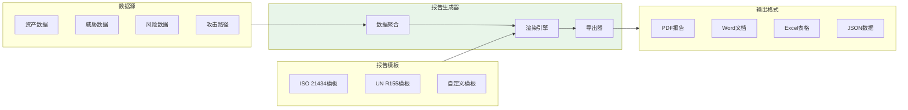

---

## 5. 数据模型设计

### 5.1 知识图谱本体设计

基于UCO (Unified Cybersecurity Ontology) 构建汽车安全本体。

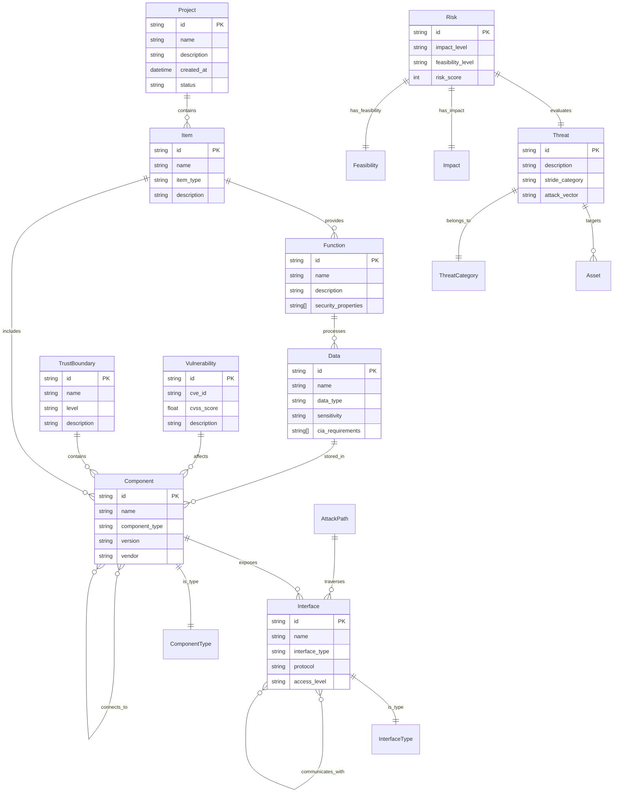

### 5.2 图数据库节点设计

#### 5.2.1 节点类型定义

| 节点标签 | 说明 | 关键属性 |
|---------|------|---------|
| `:Project` | 分析项目 | id, name, status, created_at |
| `:Item` | 分析对象(如IVI、T-BOX) | id, name, item_type |
| `:Function` | 功能 | id, name, security_properties |
| `:Component` | 组件(软件/硬件) | id, name, type, version, vendor |
| `:Interface` | 接口 | id, name, protocol, access_level |
| `:Data` | 数据资产 | id, name, sensitivity, cia |
| `:TrustBoundary` | 信任边界 | id, name, level |
| `:Threat` | 威胁 | id, description, stride_category |
| `:Vulnerability` | 漏洞 | id, cve_id, cvss_score |
| `:Risk` | 风险评估 | id, impact, feasibility, score |
| `:Mitigation` | 缓解措施 | id, description, effectiveness |

#### 5.2.2 关系类型定义

| 关系类型 | 起点 | 终点 | 说明 |
|---------|------|------|-----|
| `CONTAINS` | Project | Item | 项目包含分析对象 |
| `PROVIDES` | Item | Function | 对象提供功能 |
| `INCLUDES` | Item/Component | Component | 包含组件 |
| `EXPOSES` | Component | Interface | 组件暴露接口 |
| `CONNECTS_TO` | Component | Component | 组件连接 |
| `COMMUNICATES_WITH` | Interface | Interface | 接口通信 |
| `PROCESSES` | Function | Data | 功能处理数据 |
| `STORED_IN` | Data | Component | 数据存储位置 |
| `WITHIN` | Component | TrustBoundary | 组件所属信任域 |
| `TARGETS` | Threat | Asset | 威胁针对资产 |
| `AFFECTS` | Vulnerability | Component | 漏洞影响组件 |
| `MITIGATES` | Mitigation | Threat | 措施缓解威胁 |

### 5.3 图数据库Schema示意

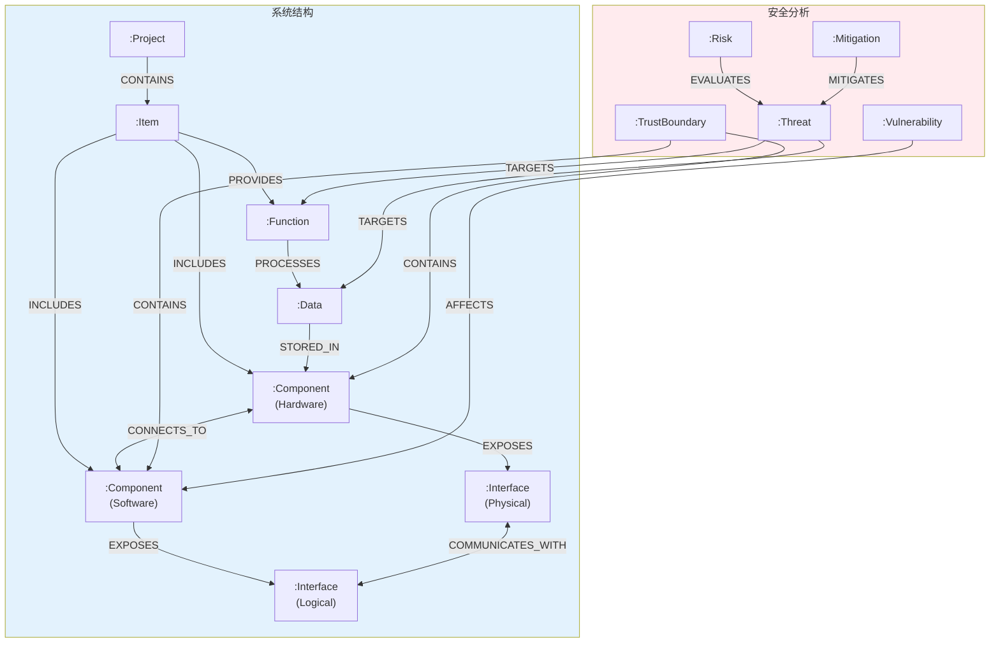

### 5.4 向量数据库Schema

Milvus集合设计用于RAG检索：

| 集合名称 | 向量维度 | 用途 |
|---------|---------|-----|
| `threat_knowledge` | 1536 | 威胁知识库检索 |
| `cve_database` | 1536 | CVE漏洞库检索 |
| `attack_patterns` | 1536 | 攻击模式检索 |
| `iso21434_clauses` | 1536 | 标准条款检索 |
| `unr155_threats` | 1536 | UN R155威胁目录 |

---

## 6. API接口设计

### 6.1 API设计原则

- 遵循RESTful设计规范
- 使用OpenAPI 3.1规范描述
- 版本化API (v1)
- 统一的错误响应格式
- JWT认证 + API Key支持

### 6.2 核心API端点

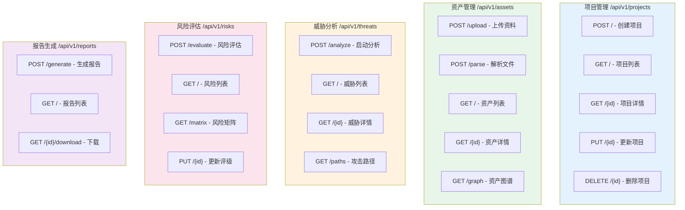

### 6.3 API响应格式

#### 成功响应

```json
{
  "success": true,
  "data": { ... },
  "meta": {
    "timestamp": "2026-01-29T10:30:00Z",
    "request_id": "uuid"
  }
}
```

#### 错误响应

```json
{
  "success": false,
  "error": {
    "code": "VALIDATION_ERROR",
    "message": "Invalid input data",
    "details": [ ... ]
  },
  "meta": {
    "timestamp": "2026-01-29T10:30:00Z",
    "request_id": "uuid"
  }
}
```

### 6.4 关键API时序图

#### 6.4.1 资产解析流程

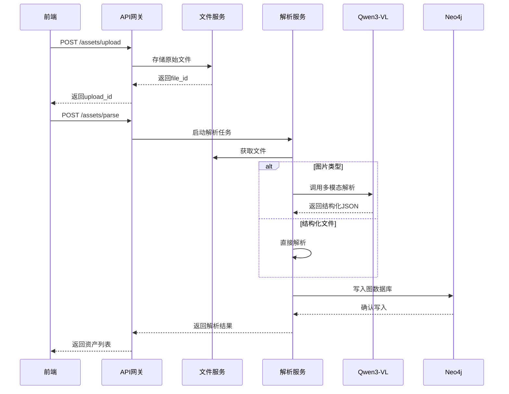

#### 6.4.2 威胁分析流程

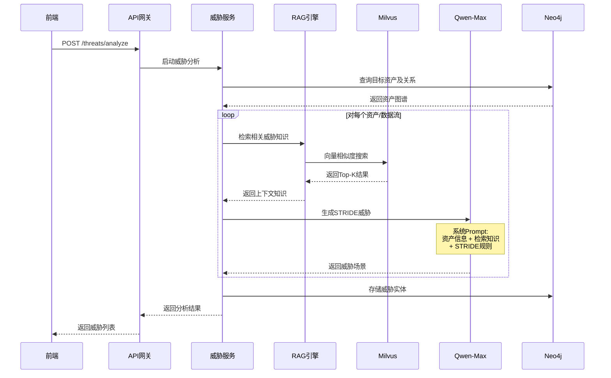

---

## 7. AI推理引擎设计

### 7.1 多智能体架构

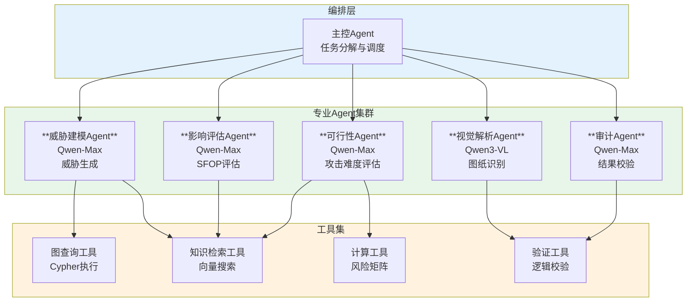

### 7.2 视觉解析Agent设计

#### 7.2.1 处理流程

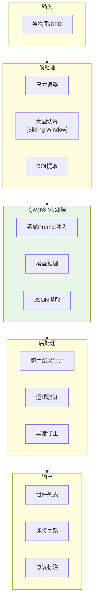

#### 7.2.2 System Prompt设计

```markdown
## 角色定义
你是一位资深的汽车电子系统架构师，精通ISO 26262和ISO/SAE 21434标准。

## 任务描述
分析上传的系统架构图（System Architecture Diagram）或数据流图（DFD）。

## 输出要求
1. 识别图中所有的矩形框，定义为"组件（Component）"
2. 识别所有连线，定义为"连接（Connection）"
3. 提取连线旁的文字标注，作为"协议（Protocol）"或"数据流（Data Flow）"
4. 识别无线连接图标（波浪线、天线），标记为"无线接口"
5. 识别信任边界（虚线框、颜色区分）

## 输出格式
严格输出以下JSON格式：
{
  "components": [
    {"id": "c1", "name": "组件名", "type": "hardware|software", "position": {"x": 0, "y": 0}}
  ],
  "connections": [
    {"source": "c1", "target": "c2", "protocol": "CAN", "data_flow": "诊断数据"}
  ],
  "trust_boundaries": [
    {"id": "tb1", "name": "边界名", "components": ["c1", "c2"]}
  ]
}
```

### 7.3 威胁推理Agent设计

#### 7.3.1 STRIDE规则引擎

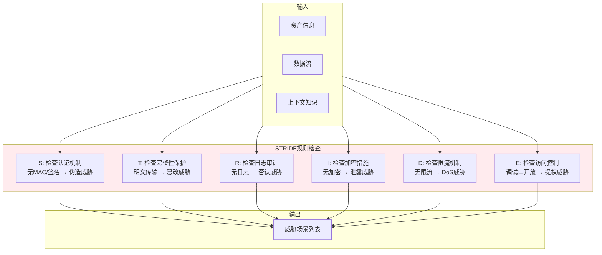

#### 7.3.2 威胁生成Prompt模板

```markdown
## 角色
你是一名汽车网络安全专家，精通ISO/SAE 21434标准和STRIDE威胁建模方法。

## 背景
资产信息：{asset_info}
数据流描述：{data_flow}
参考知识库：{retrieved_knowledge}

## 任务
基于STRIDE模型，识别该资产/数据流的潜在威胁场景。

## 约束
1. 每个STRIDE类别至少考虑一个威胁
2. 威胁描述需具体，包含攻击者行为和影响
3. 关联UN R155 Annex 5中的威胁类别（如适用）

## 输出格式
| ID | 威胁描述 | STRIDE类别 | 攻击向量 | 影响维度(SFOP) |
|----|---------|-----------|---------|---------------|
```

### 7.4 RAG检索引擎设计

```mermaid
flowchart LR
    subgraph Query["查询处理"]
        UserQuery["用户查询/资产描述"]
        QueryEmbed["查询向量化<br/>text-embedding-v3"]
    end

    subgraph Retrieval["检索"]
        VectorSearch["向量相似度搜索<br/>Milvus"]
        Rerank["重排序<br/>Cross-Encoder"]
        TopK["Top-K结果"]
    end

    subgraph KnowledgeBases["知识库"]
        CVE["CVE漏洞库"]
        MITRE["MITRE ATT&CK<br/>for Vehicle"]
        ISO["ISO 21434<br/>标准条款"]
        UNR155["UN R155<br/>威胁目录"]
        History["历史TARA<br/>案例库"]
    end

    subgraph Generation["生成"]
        Context["上下文组装"]
        LLM["Qwen-Max<br/>生成回答"]
    end

    UserQuery --> QueryEmbed
    QueryEmbed --> VectorSearch
    VectorSearch --> KnowledgeBases
    KnowledgeBases --> Rerank
    Rerank --> TopK
    TopK --> Context
    Context --> LLM

    style Retrieval fill:#e8f5e9
    style KnowledgeBases fill:#e3f2fd
```

---

## 8. 知识图谱设计

### 8.1 图谱构建流程

```mermaid
flowchart TB
    subgraph DataSources["数据源"]
        BOM["BOM清单"]
        DFD["数据流图"]
        Arch["架构图"]
        Spec["规范文档"]
    end

    subgraph Extraction["实体抽取"]
        AI_Extract["AI抽取<br/>Qwen-VL/Max"]
        Rule_Extract["规则抽取<br/>正则/模板"]
    end

    subgraph EntityResolution["实体消歧"]
        Dedup["去重"]
        Merge["合并"]
        Link["链接"]
    end

    subgraph GraphConstruction["图谱构建"]
        NodeCreate["节点创建"]
        RelCreate["关系创建"]
        PropEnrich["属性丰富"]
    end

    subgraph Validation["验证"]
        Schema_Check["Schema校验"]
        Logic_Check["逻辑校验"]
        Human_Review["人工审核"]
    end

    DataSources --> Extraction
    Extraction --> EntityResolution
    EntityResolution --> GraphConstruction
    GraphConstruction --> Validation

    style Extraction fill:#e8f5e9
    style GraphConstruction fill:#e3f2fd
```

### 8.2 攻击路径分析

#### 8.2.1 Cypher查询示例

```cypher
// 查找从外部蜂窝接口到车门解锁功能的最短攻击路径
MATCH (source:Interface {access_level: 'Public', type: 'Cellular'})
MATCH (target:Function {name: 'Door_Unlock'})
MATCH path = shortestPath((source)-[*..10]->(target))
WHERE ALL(r IN relationships(path) WHERE r.blocked = false)
RETURN path, length(path) as hops
ORDER BY hops
LIMIT 5
```

#### 8.2.2 攻击路径可视化

```mermaid
graph LR
    subgraph External["外部网络"]
        Cellular["蜂窝接口<br/>📡"]
    end

    subgraph TBOX["T-BOX域"]
        Modem["Modem<br/>调制解调器"]
        TBOX_MCU["T-BOX MCU"]
    end

    subgraph Gateway["网关域"]
        GW["车辆网关"]
    end

    subgraph Body["车身域"]
        BCM["车身控制器<br/>(BCM)"]
        Door["车门ECU<br/>🚪"]
    end

    Cellular -->|LTE| Modem
    Modem -->|UART| TBOX_MCU
    TBOX_MCU -->|Ethernet| GW
    GW -->|CAN| BCM
    BCM -->|LIN| Door

    style Cellular fill:#ffcdd2
    style Door fill:#c8e6c9
```

### 8.3 图谱查询优化

| 优化策略 | 说明 | 适用场景 |
|---------|------|---------|
| **索引优化** | 为高频查询属性建立索引 | 按ID、名称查询 |
| **路径长度限制** | 限制`shortestPath`深度 | 攻击路径分析 |
| **关系过滤** | 提前过滤不可达关系 | 跨信任域分析 |
| **结果缓存** | 缓存常用查询结果 | 重复性分析 |

---

## 9. 工作流程设计

### 9.1 完整TARA流程

```mermaid
flowchart TB
    subgraph Phase1["阶段1: 项目初始化"]
        P1_1["创建项目"]
        P1_2["定义分析范围<br/>(Item Definition)"]
        P1_3["上传工程资料"]
    end

    subgraph Phase2["阶段2: 资产识别"]
        P2_1["解析BOM"]
        P2_2["解析架构图"]
        P2_3["构建资产图谱"]
        P2_4["标注信任边界"]
    end

    subgraph Phase3["阶段3: 威胁分析"]
        P3_1["识别数据流"]
        P3_2["STRIDE威胁生成"]
        P3_3["攻击路径分析"]
        P3_4["威胁场景确认"]
    end

    subgraph Phase4["阶段4: 风险评估"]
        P4_1["影响评级(SFOP)"]
        P4_2["可行性评估"]
        P4_3["风险计算"]
        P4_4["风险排序"]
    end

    subgraph Phase5["阶段5: 处置与报告"]
        P5_1["制定缓解措施"]
        P5_2["生成TARA报告"]
        P5_3["合规性审核"]
        P5_4["导出归档"]
    end

    Phase1 --> Phase2 --> Phase3 --> Phase4 --> Phase5

    style Phase1 fill:#e3f2fd
    style Phase2 fill:#e8f5e9
    style Phase3 fill:#fff3e0
    style Phase4 fill:#fce4ec
    style Phase5 fill:#f3e5f5
```

### 9.2 状态机设计

```mermaid
stateDiagram-v2
    [*] --> Draft: 创建项目
    Draft --> Analyzing: 启动分析
    Analyzing --> AssetIdentification: 资产识别
    AssetIdentification --> ThreatModeling: 威胁建模
    ThreatModeling --> RiskAssessment: 风险评估
    RiskAssessment --> Review: 提交审核
    Review --> Approved: 审核通过
    Review --> ThreatModeling: 退回修改
    Approved --> Archived: 归档

    Draft --> [*]: 删除
    Analyzing --> Draft: 取消
```

### 9.3 IVI系统TARA流程示例

```mermaid
sequenceDiagram
    participant User as 安全工程师
    participant Platform as TARA平台
    participant AI as AI引擎
    participant Graph as 知识图谱

    User->>Platform: 创建IVI TARA项目
    User->>Platform: 上传IVI架构图、BOM

    Platform->>AI: 解析架构图
    AI-->>Platform: 返回组件、连接关系

    Platform->>Graph: 构建IVI资产图谱
    Note over Graph: 节点: SoC, WiFi, BT,<br/>USB, Apps...<br/>关系: 连接、依赖

    User->>Platform: 启动威胁分析
    Platform->>AI: STRIDE威胁生成
    Note over AI: 分析每个数据流<br/>生成威胁场景

    AI->>Graph: 查询攻击路径
    Graph-->>AI: 返回可达路径
    AI-->>Platform: 返回威胁+路径

    User->>Platform: 确认威胁场景
    Platform->>AI: 风险评估
    AI-->>Platform: 返回影响/可行性评级

    Platform->>Platform: 计算风险矩阵
    User->>Platform: 生成报告
    Platform-->>User: 下载TARA报告
```

---

## 10. 安全设计

### 10.1 安全架构

```mermaid
flowchart TB
    subgraph Perimeter["边界安全"]
        WAF["Web应用防火墙"]
        DDoS["DDoS防护"]
        SSL["TLS 1.3加密"]
    end

    subgraph Access["访问控制"]
        Auth["身份认证<br/>JWT + OAuth2"]
        RBAC["角色权限<br/>RBAC模型"]
        MFA["多因素认证"]
    end

    subgraph Data["数据安全"]
        Encrypt["数据加密<br/>AES-256"]
        Mask["敏感数据脱敏"]
        Backup["数据备份"]
    end

    subgraph Audit["审计监控"]
        Log["操作日志"]
        Monitor["实时监控"]
        Alert["异常告警"]
    end

    Perimeter --> Access --> Data --> Audit

    style Perimeter fill:#ffcdd2
    style Access fill:#fff9c4
    style Data fill:#c8e6c9
    style Audit fill:#bbdefb
```

### 10.2 认证授权设计

#### 10.2.1 RBAC角色模型

| 角色 | 权限 | 说明 |
|-----|------|-----|
| **Admin** | 全部权限 | 系统管理员 |
| **Analyst** | 项目CRUD、分析执行、报告生成 | 安全分析师 |
| **Reviewer** | 项目只读、审核、评论 | 审核人员 |
| **Viewer** | 项目只读、报告下载 | 查看者 |

#### 10.2.2 API安全

```mermaid
sequenceDiagram
    participant Client as 客户端
    participant Gateway as API网关
    participant Auth as 认证服务
    participant API as 业务API

    Client->>Gateway: 请求 + JWT Token
    Gateway->>Gateway: 验证Token签名
    Gateway->>Auth: 验证Token有效性
    Auth-->>Gateway: Token有效
    Gateway->>Gateway: 检查RBAC权限
    Gateway->>API: 转发请求
    API-->>Gateway: 响应
    Gateway-->>Client: 返回结果
```

### 10.3 数据安全

| 数据类型 | 加密方式 | 存储位置 |
|---------|---------|---------|
| 用户凭证 | bcrypt哈希 | PostgreSQL |
| API密钥 | AES-256加密 | PostgreSQL |
| 上传文件 | 服务端加密 | MinIO (SSE-S3) |
| 敏感配置 | 环境变量/Vault | 运行时 |

---

## 11. 部署架构

### 11.1 容器化部署

```mermaid
flowchart TB
    subgraph K8s["Kubernetes集群"]
        subgraph Ingress["入口层"]
            Nginx["Nginx Ingress"]
        end

        subgraph Frontend["前端"]
            WebPod1["Web Pod 1"]
            WebPod2["Web Pod 2"]
        end

        subgraph Backend["后端"]
            APIPod1["API Pod 1"]
            APIPod2["API Pod 2"]
            APIPod3["API Pod 3"]
        end

        subgraph Workers["工作节点"]
            ParserWorker["Parser Worker"]
            AIWorker["AI Worker"]
            ReportWorker["Report Worker"]
        end

        subgraph Storage["存储"]
            Neo4jSTS["Neo4j<br/>StatefulSet"]
            RedisSTS["Redis<br/>StatefulSet"]
            MilvusSTS["Milvus<br/>StatefulSet"]
        end
    end

    subgraph External["外部服务"]
        AliyunAI["阿里云百炼"]
        PostgreSQLRDS["PostgreSQL RDS"]
        MinIOOSS["MinIO/OSS"]
    end

    Nginx --> Frontend
    Frontend --> Backend
    Backend --> Workers
    Backend --> Storage
    Workers --> Storage
    Backend --> External
    Workers --> External

    style K8s fill:#e3f2fd
    style External fill:#f3e5f5
```

### 11.2 高可用设计

```mermaid
flowchart TB
    subgraph Region1["区域1 (主)"]
        LB1["负载均衡器"]
        App1["应用集群"]
        DB1["数据库主"]
    end

    subgraph Region2["区域2 (备)"]
        LB2["负载均衡器"]
        App2["应用集群"]
        DB2["数据库从"]
    end

    DNS["DNS<br/>全局负载均衡"] --> LB1 & LB2
    LB1 --> App1 --> DB1
    LB2 --> App2 --> DB2
    DB1 <-->|同步| DB2

    style Region1 fill:#c8e6c9
    style Region2 fill:#fff9c4
```

### 11.3 资源配置建议

| 组件 | CPU | 内存 | 存储 | 副本数 |
|-----|-----|------|------|-------|
| Web前端 | 0.5核 | 512MB | - | 2+ |
| API服务 | 2核 | 4GB | - | 3+ |
| AI Worker | 4核 | 8GB | - | 2+ |
| Neo4j | 4核 | 16GB | 100GB SSD | 3 (集群) |
| Milvus | 4核 | 16GB | 200GB SSD | 3 (集群) |
| Redis | 2核 | 4GB | 10GB | 3 (哨兵) |

### 11.4 监控告警

```mermaid
flowchart LR
    subgraph Apps["应用层"]
        API["API服务"]
        Worker["Worker"]
    end

    subgraph Metrics["指标采集"]
        Prometheus["Prometheus"]
        Loki["Loki日志"]
    end

    subgraph Visualization["可视化"]
        Grafana["Grafana"]
    end

    subgraph Alerting["告警"]
        AlertManager["AlertManager"]
        PagerDuty["PagerDuty"]
        DingTalk["钉钉"]
    end

    Apps --> Prometheus
    Apps --> Loki
    Prometheus --> Grafana
    Loki --> Grafana
    Prometheus --> AlertManager
    AlertManager --> PagerDuty & DingTalk

    style Metrics fill:#e8f5e9
    style Alerting fill:#ffcdd2
```

---

## 附录

### A. 参考标准与法规

| 标准/法规 | 全称 | 说明 |
|----------|------|-----|
| ISO/SAE 21434 | Road vehicles — Cybersecurity engineering | 汽车网络安全工程标准 |
| UN R155 | Uniform provisions concerning the approval of vehicles with regards to cyber security | 联合国车辆网络安全法规 |
| UN R156 | Software update and software update management systems | 软件更新管理法规 |
| ISO 26262 | Functional Safety | 功能安全标准 |
| MITRE ATT&CK for Vehicle | - | 汽车攻击矩阵 |

### B. 威胁知识库来源

1. **CVE Database** - 通用漏洞披露数据库
2. **Auto-ISAC** - 汽车信息共享与分析中心
3. **MITRE ATT&CK for Automotive** - 汽车攻击矩阵
4. **UN R155 Annex 5** - 威胁与缓解措施目录
5. **OWASP Automotive Security** - OWASP汽车安全项目

### C. 技术版本汇总

| 组件 | 版本 | 更新日期 |
|-----|------|---------|
| Python | 3.12+ | - |
| FastAPI | 0.128.0 | 2026-01 |
| Pydantic | 2.12.5 | 2026-01 |
| structlog | 25.5.0 | 2025 |
| React | 19.2.4 | 2026-01-26 |
| TypeScript | 5.9 | 2026-01 |
| Vite | 7.3.1 | 2026-01 |
| Tailwind CSS | 4.1.18 | 2025-12 |
| Neo4j | 2025.12.1 | 2025-12 |
| Neo4j Python Driver | 6.1.0 | 2026-01-12 |
| Milvus | 2.6.9 | 2026-01 |
| uv | 0.9.27 | 2026-01-26 |
| Qwen3-VL | Latest | 2025-11 |
| Qwen-Max | 2026-01-23 | 2026-01-23 |
| text-embedding-v3 | Latest | - |

### D. 词汇表

| 英文 | 中文 | 说明 |
|-----|------|-----|
| TARA | 威胁分析与风险评估 | Threat Analysis and Risk Assessment |
| IVI | 车载信息娱乐系统 | In-Vehicle Infotainment |
| T-BOX | 远程信息处理器 | Telematics Box |
| ECU | 电子控制单元 | Electronic Control Unit |
| CAN | 控制器局域网 | Controller Area Network |
| E/E Architecture | 电子电气架构 | Electrical/Electronic Architecture |
| SDV | 软件定义汽车 | Software Defined Vehicle |
| CSMS | 网络安全管理体系 | Cyber Security Management System |
| FOTA | 固件空中升级 | Firmware Over-The-Air |
| PKI | 公钥基础设施 | Public Key Infrastructure |

---

**文档版本历史**

| 版本 | 日期 | 作者 | 变更说明 |
|-----|------|------|---------|
| 1.0.0 | 2026-01-29 | AI TARA Team | 初始版本 |

---

*本文档基于 [specs/tara-deepresearch.md](./tara-deepresearch.md) 研究报告生成*
